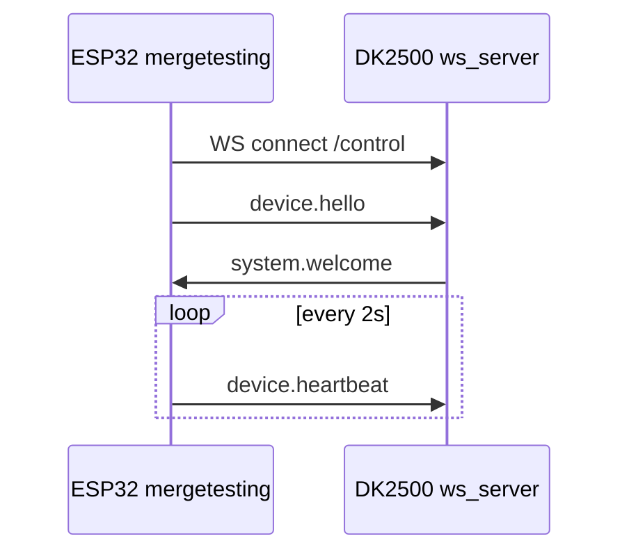
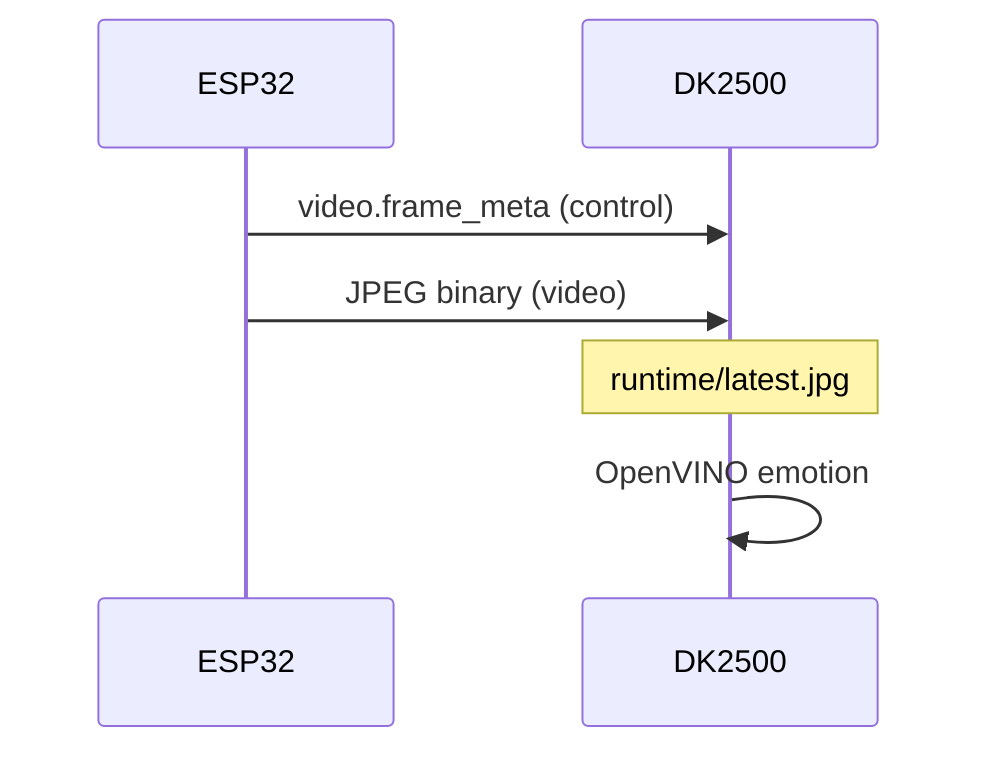

# 联调阶段 & 数据流

## Phase 1 — 控制通道



**烧录：** `mergetesting_display_only`
**OTA：** `mergetesting_display_only_ota`（仅当板上已有 OTA-enabled firmware）
**基站：** `python -m base_station.ws_server.server`

## Phase 2 — 基站控车

```powershell
python tools/send_robot_command.py expression caring
python tools/send_robot_command.py motion move_out_of_dock
python tools/send_robot_command.py local care_01
```

ESP32 回：每条命令 `command.ack`；motion ack/completed 带同一个 `action_id`；`stop` 会打断前一动作并回 `motion.completed` / `result: interrupted`。

## Phase 3 — 视频回传



**烧录：** `mergetesting_cam_only`（无 TFT）
**注意：** 不是 `motor_cam_wifi_manual` 的 HTTP MJPEG。

## Phase 4 — 主动关怀

```
/video frame → fatigue_score → EmotionEventLoop → OpenClaw
  → display.expression + motion.execute + audio.play_local
  → ESP32 执行 + ack
```

当前 mock 路径可用：`tests/mocks/mock_robot.py` + fake emotion 源。

## 通信对照

| 需求 | 正确 | 错误 |
|------|------|------|
| 传画到 DK2500 | WS `/video` | HTTP `192.168.4.1:81/stream` |
| 控车 | WS `/control` JSON | 仅 AP 网页 |
| 发命令给真机 | 基站 `/agent` 或直连 session | 只跑 mock_robot |

## device_id

联调默认：`xiaoan_robot_01`（`mergetesting/src/config.h`）
