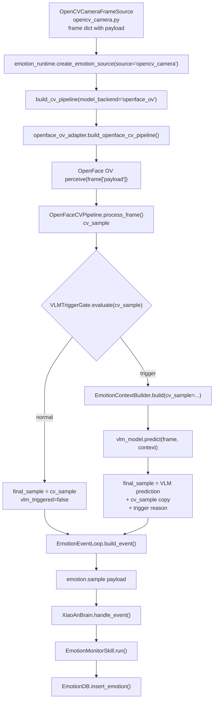

# Xiao-An OpenFace / VLM Progress Handoff

> ⚠️ **ARCHIVED 2026-06-27** — moved from repo root. Use `docs/openface_au_mapping.md`, `docs/agents/04_base_station_agent_registry.md`, and latest `project_status_*` instead.

Last updated: 2026-06-18

This document is meant to be uploaded or pasted into another GPT/Claude/Codex thread so the next model can understand the current OpenFace-to-xiao-an progress without needing the full zip. It is intentionally factual and code-oriented. It separates implemented behavior, verified tests, local-only artifacts, and known gaps.

## How To Use This Document With Another Model

Recommended transfer method:

1. Upload or paste this single Markdown file first.
2. If the next model needs exact code, upload only the small source files listed in the "Key Files" section, not the whole repository.
3. Do not upload model binaries or `base_station/models/openface_ov/` unless the target environment explicitly needs to run real OpenFace/OpenVINO inference.
4. Ask the model to preserve the verified/unverified boundaries in this document.

Why not zip the whole repo:

- The repo contains local model artifacts and generated/runtime files that are large and not useful for reasoning.
- A zip can hide the current state, untracked files, and branch-specific changes.
- A single Markdown handoff gives the next model the architecture, file map, payload contracts, known bugs, and exact next edits faster.

If a model needs code context, upload this document plus these files first:

```text
base_station/monitor/emotion_runtime.py
base_station/monitor/emotion_event_loop.py
base_station/monitor/emotion_db.py
agent/skills/emotion_monitor.py
base_station/perception/openface_ov_adapter.py
base_station/perception/openface_cv_pipeline.py
base_station/perception/fatigue/face_metrics.py
base_station/perception/fatigue/affect_metrics.py
base_station/perception/valence_mapping.py
base_station/perception/vlm_trigger_gate.py
tools/probe_openface_routeA_live.py
tools/probe_cv_gate.py
tests/unit/test_openface_cv_pipeline.py
tests/unit/test_vlm_trigger_gate.py
tests/unit/test_emotion_event_loop.py
tests/unit/test_emotion_db.py
tests/unit/test_emotion_monitor_skill.py
```

## Repository State

Actual repository root:

```text
C:\Users\Lenovo\Desktop\xiao-an-robot\xiao-an-robot
```

The outer folder `C:\Users\Lenovo\Desktop\xiao-an-robot` is only a container and is not the Git repo.

Current branch observed on 2026-06-18:

```text
feature/openface-ov-integration...origin/feature/openface-ov-integration [behind 1]
```

Current worktree is dirty. Important local/uncommitted items include:

```text
M  base_station/monitor/emotion_runtime.py
M  base_station/perception/vlm_trigger_gate.py
M  tests/unit/test_emotion_runtime.py
M  tests/unit/test_probe_cv_gate.py
M  tests/unit/test_vlm_trigger_gate.py
MM tools/probe_cv_gate.py
?? base_station/models/openface_ov/
?? base_station/perception/openface_ov_adapter.py
?? base_station/perception/openface_ov_runtime/
?? tools/probe_openface_routeA_live.py
```

Important caution:

- Do not run broad `git add .`.
- Do not commit model binaries unless the user explicitly says so.
- Treat `base_station/models/openface_ov/` as local model artifact state.
- There are user/previous-agent changes in several files. Do not revert unrelated edits.

## Executive Summary

Current intended visual chain:

```text
OpenCV camera frame
  -> OpenFace OpenVINO perceive
  -> OpenFaceCVPipeline rule-v0 cv_sample
  -> VLMTriggerGate
  -> optional VLM
  -> final emotion sample
  -> EmotionEventLoop builds emotion.sample
  -> XiaoAnBrain
  -> EmotionMonitorSkill
  -> EmotionDB
  -> RobotMotionSkill / RobotGateway when intervention is needed
```

What is structurally connected:

- `opencv_camera` can build a camera frame dict with `payload`.
- `model_backend="openface_ov"` routes runtime CV processing into `openface_ov_adapter`.
- `openface_ov_adapter` unwraps `frame["payload"]` and calls OpenFace/OpenVINO `perceive`.
- `OpenFaceCVPipeline.process_frame()` converts OpenFace perception output into a `cv_sample`.
- `VLMTriggerGate` evaluates `cv_sample`.
- If gate triggers, `VLMGatedCameraEmotionSource` calls the configured VLM and yields a VLM-derived final sample.
- `EmotionEventLoop.build_event()` wraps the final sample as `emotion.sample`.

What is verified by tests:

- OpenFaceCVPipeline contract fields and rule-v0 behavior are unit-tested.
- EAR/MAR/PERCLOS fatigue helpers are unit-tested.
- VLMTriggerGate behavior is unit-tested, including the current `fatigue_score >= 67.0` default threshold.
- EmotionEventLoop passes through several OpenFace fields, including `valence`.
- EmotionDB schema supports `polarity`, `fatigue_level`, `observation_quality`, `evidence_codes`, `algorithm_version`, `presence_state`, `valence`, and `au_json`.

What is not yet fully verified:

- Real camera + real OpenFace OV models + real VLM end-to-end run was not verified in this handoff.
- OpenFace `polarity` / `valence` are not fully persisted through the normal runtime DB path yet.
- `EmotionMonitorSkill` still treats fatigue score as a 0..1 style threshold (`fatigue_threshold=0.7`), while OpenFace rule-v0 fatigue score is 0..100 style.

## High-Level Mermaid Flow



## Key Files And Responsibilities

### `base_station/monitor/emotion_runtime.py`

Main runtime assembly point.

Important classes/functions:

- `VLMGatedCameraEmotionSource`
- `create_face_emotion_model()`
- `create_vlm_emotion_model()`
- `build_cv_pipeline()`
- `create_emotion_source()`
- `create_runtime()`

Current OpenFace route:

```python
def build_cv_pipeline(
    model_backend: str,
    pattern: str,
    model_path: str | None,
    device: str,
    openface_repo: str | None = None,
    openface_models_dir: str | None = None,
):
    if model_backend == "openface_ov":
        build = _load_openface_ov_adapter()
        return build(
            openface_repo=openface_repo,
            models_dir=openface_models_dir,
            device=device,
        )
```

Gate flow:

```python
cv_sample = self.cv_pipeline.process_frame(frame)
gate_result = self.gate.evaluate(cv_sample, force_vlm=self.force_vlm)

if gate_result.get("should_trigger", False):
    context = self.context_builder.build(
        cv_sample=cv_sample,
        vlm_sample=None,
        asr_text=None,
        history_summary=self._history_summary(),
    )
    prediction = await asyncio.to_thread(self.vlm_model.predict, frame, context)
    final_sample = prediction.copy()
    final_sample["vlm_triggered"] = True
    final_sample["vlm_trigger_reason"] = reason
    final_sample["cv_sample"] = cv_sample.copy()
else:
    final_sample = cv_sample.copy()
    final_sample["vlm_triggered"] = False
    final_sample["vlm_trigger_reason"] = reason
```

Important behavior:

- `vlm_triggered`, `vlm_trigger_reason`, and `cv_sample` exist in the pre-event final sample.
- These fields do not necessarily survive into `emotion.sample.payload`.

### `base_station/perception/openface_ov_adapter.py`

Adapter between xiao-an frame dictionaries and OpenFace OV runtime.

Purpose:

- Locate bundled runtime or external OpenFace repo.
- Locate OpenFace OV IR model directory.
- Import `ov_perceive`.
- Build `perceive(frame) -> dict | None`.
- Unwrap xiao-an frame dict into raw BGR image.

Important logic:

```python
img = frame.get("payload") if isinstance(frame, dict) else frame
if img is None:
    return None
return raw_perceive(img)
```

Default paths:

```text
base_station/perception/openface_ov_runtime
base_station/models/openface_ov
```

Local model directory is untracked/local-only in current worktree.

### `base_station/perception/openface_cv_pipeline.py`

This is the main OpenFace-to-xiao-an judgment layer.

Input from `perceive`:

```text
landmarks: WFLW-98 array, or None
face_confidence: float 0..1
emotion_label: OpenFace 8-class label
emotion_confidence: float 0..1
au: action unit vector/dict
```

Output `cv_sample` contract:

```text
source
timestamp_ms
frame_id
emotion_tag
confidence
fatigue_score
polarity
fatigue_level
observation_quality
evidence_codes
algorithm_version
presence_state
valence
au_json
frame_b64
```

Relevant return shape:

```python
return {
    "source": "openface_fatigue_metrics",
    "timestamp_ms": ts_ms,
    "frame_id": self._frame_id,
    "emotion_tag": emotion_tag,
    "confidence": confidence,
    "fatigue_score": fatigue["score"],
    "polarity": vm.valence_to_polarity(valence),
    "fatigue_level": fatigue_level,
    "observation_quality": observation_quality,
    "evidence_codes": fatigue["evidence"],
    "algorithm_version": "rule_v0",
    "presence_state": affect.get("presence_state", "uncertain"),
    "valence": valence,
    "au_json": au,
    "frame_b64": None,
}
```

Important:

- `polarity` is produced here.
- `valence` is produced here.
- Raw `ear`, `mar`, `perclos`, and `face_confidence` are used internally but are not included in final `cv_sample`.
- `au_json` is preserved for downstream analysis/storage, not used for fatigue decision.

### `base_station/perception/fatigue/face_metrics.py`

Reusable fatigue metric helpers.

Landmark groups:

```python
WFLW98_RIGHT_EYE = tuple(range(60, 68))
WFLW98_LEFT_EYE = tuple(range(68, 76))
WFLW98_OUTER_LIP = tuple(range(76, 88))
WFLW98_INNER_LIP = tuple(range(88, 96))
WFLW98_LEFT_PUPIL = 96
WFLW98_RIGHT_PUPIL = 97
```

Thresholds:

```python
DEFAULT_EAR_CLOSED_THRESHOLD = 0.15
DEFAULT_MAR_YAWN_THRESHOLD = 0.9
```

EAR path:

```python
def compute_ear(landmarks):
    points = _as_landmarks_array(landmarks)
    right_ear = _eye_aspect_ratio(points, WFLW98_RIGHT_EYE)
    left_ear = _eye_aspect_ratio(points, WFLW98_LEFT_EYE)
    values = [value for value in (right_ear, left_ear) if value is not None]
    if not values:
        return None
    return float(np.mean(values))
```

MAR path:

```python
def compute_mar(landmarks):
    points = _as_landmarks_array(landmarks)
    horizontal = _distance(points[88], points[92])
    vertical = (
        _distance(points[89], points[95])
        + _distance(points[90], points[94])
        + _distance(points[91], points[93])
    ) / 3.0
    return _ratio(vertical, horizontal)
```

Fatigue rule-v0:

- If `observation_quality < q_min`, returns `level="insufficient_evidence"` and `score=None`.
- Strong evidence:
  - `LONG_CLOSURE`
  - `PERCLOS_HIGH`
- Auxiliary evidence:
  - `YAWN`
  - `PERCLOS_MID`
- Normal low score otherwise.

Score scale:

- `LOW`: 0..33
- `MEDIUM`: 34..66
- `HIGH`: 67..100
- `insufficient_evidence`: `None`

This is why VLM gate default fatigue threshold was changed to `67.0`.

### `base_station/perception/fatigue/affect_metrics.py`

Smoothing layer for OpenFace emotion labels.

Responsibilities:

- Track recent emotion labels/confidence in a time window.
- Derive `presence_state`.
- Derive `valence` such as `positive`, `negative`, `neutral`, or `uncertain`.

Important verified mapping:

```text
Happy -> positive
Sad -> negative
Neutral -> neutral
Surprise -> neutral
Fear -> negative
Disgust -> negative
Anger -> negative
Contempt -> negative
```

### `base_station/perception/valence_mapping.py`

Maps OpenFace 8-class labels into xiao-an legacy gate vocabulary and Chinese polarity.

Important concepts:

- `classify_valence(label)` returns `positive`, `negative`, `neutral`, or `uncertain`.
- `valence_to_polarity(valence)` maps:
  - `negative` -> `负面`
  - everything else conservative/default -> `正面`
- `to_gate_emotion_tag(label)` maps OpenFace negative labels into gate-friendly labels such as `sad`, `anxious`, `stressed`, etc.

This exists so the old `VLMTriggerGate` can still fire on OpenFace emotion labels.

### `base_station/perception/vlm_trigger_gate.py`

Lightweight VLM trigger logic.

Current default threshold:

```python
fatigue_threshold: float = 67.0
```

Trigger reasons:

- `force`
- `high_fatigue`
- `negative_emotion`
- `negative_emotion_window`
- `normal`

Current logic:

```python
if force_vlm:
    return {"should_trigger": True, "reason": "force"}

if fatigue_score >= self.fatigue_threshold:
    return {"should_trigger": True, "reason": "high_fatigue"}

if is_confident_negative:
    return {"should_trigger": True, "reason": "negative_emotion"}

if sum(self._recent_negative_flags) >= self.negative_count_threshold:
    return {"should_trigger": True, "reason": "negative_emotion_window"}
```

Recent change:

- Default `fatigue_threshold` changed from `0.8` to `67.0`.
- Rationale: OpenFace rule-v0 fatigue score is 0..100 style, with HIGH starting at 67.
- Tests now assert `66` does not trigger high fatigue and `67` does.

Important caveat:

- Non-OpenFace backends and old mock models may still output 0..1 fatigue scores.
- With default `67.0`, those old mock 0..1 values no longer trigger `high_fatigue`.
- They can still trigger VLM via negative emotion labels.

### `base_station/monitor/emotion_event_loop.py`

Wraps a sample into an `emotion.sample` event.

Current passthrough fields:

```python
_OPTIONAL_PASSTHROUGH = (
    "fatigue_level",
    "observation_quality",
    "evidence_codes",
    "algorithm_version",
    "presence_state",
    "valence",
    "au_json",
    "frame_source",
    "frame_id",
    "timestamp_ms",
)
```

Important missing field:

- `polarity` is not in `_OPTIONAL_PASSTHROUGH`.

So:

- `OpenFaceCVPipeline` creates `polarity`.
- `EmotionEventLoop` drops `polarity`.
- `valence` survives into `emotion.sample.payload`.

Base payload:

```python
payload = {
    "source": sample.get("source", "simulator"),
    "emotion_tag": sample.get("emotion_tag", sample.get("emotion", "neutral")),
    "confidence": float(sample.get("confidence", 0.0) or 0.0),
    "fatigue_score": self._coerce_fatigue_score(sample.get("fatigue_score", 0.0)),
}
```

Important:

- `vlm_triggered`, `vlm_trigger_reason`, `cv_sample`, `message`, and `face_detected` are not passed through unless code changes.
- `fatigue_score=None` is preserved for insufficient evidence.

### `agent/core/brain.py`

Event router. Relevant behavior:

- Supports `emotion.sample` and `emotion.alert`.
- Routes emotion events to `EmotionMonitorSkill`.
- Uses `EmotionDB` as memory by default.

High-level validated path:

```text
EmotionEventLoop.handle_sample()
  -> XiaoAnBrain.handle_event()
  -> EmotionMonitorSkill.run()
  -> EmotionDB.insert_emotion()
  -> optional RobotMotionSkill.care_for_user()
```

### `agent/skills/emotion_monitor.py`

Decision and memory insertion layer.

Current parsing:

```python
return {
    "source": source,
    "emotion": str(payload.get("emotion_tag") or payload.get("emotion") or "normal").lower(),
    "confidence": float(payload.get("confidence", 0.0) or 0.0),
    "fatigue_score": float(payload.get("fatigue_score", 0.0) or 0.0),
}
```

Current DB insertion:

```python
self.memory.insert_emotion(
    source=parsed["source"],
    emotion_tag=parsed["emotion"],
    confidence=parsed["confidence"],
    fatigue_score=parsed["fatigue_score"],
)
```

Important gaps:

- Does not parse or insert `polarity`.
- Does not parse or insert `valence`.
- Does not parse or insert `fatigue_level`, `observation_quality`, `evidence_codes`, `algorithm_version`, `presence_state`, or `au_json`.
- Normalizes non-`face` / non-`voice` sources to `face`, so backend source such as `openface_fatigue_metrics` becomes `face`.
- Still uses `fatigue_threshold=0.7`, which is wrong for OpenFace 0..100 fatigue scores.

### `base_station/monitor/emotion_db.py`

SQLite emotion database.

DB schema supports:

```text
timestamp
source
emotion_tag
confidence
fatigue_score
polarity
fatigue_level
observation_quality
evidence_codes
algorithm_version
presence_state
valence
au_json
```

Important:

- `EmotionDB.insert_emotion()` supports `polarity`, `valence`, and OpenFace fields.
- But current `EmotionMonitorSkill.run()` does not pass those fields.
- Therefore the DB can store OpenFace positive/negative data, but the normal runtime path does not currently persist it correctly.

Current default:

```python
polarity: str = "正面"
```

This means a negative OpenFace sample can end up stored with default `polarity="正面"` unless the runtime pass-through is fixed.

### `tools/probe_openface_routeA_live.py`

Perception-only live route-A check.

Purpose:

- Run OpenFace route A from camera.
- Print the `cv_sample` contract fields.
- Optionally run `VLMTriggerGate` and fake/real VLM on trigger.

Important note from file:

```text
face_confidence / ear / mar / perclos / au are NOT in cv_sample -- they are used in the judgment layer and/or au_json.
```

This tool is useful for seeing what OpenFace `cv_sample` carries before the brain/event compression.

### `tools/probe_cv_gate.py`

Older/general CV gate probe utility.

Important current behavior:

- Can use `fake_camera` or `opencv_camera`.
- Can use `mock` or `openvino` backend.
- Can evaluate `VLMTriggerGate`.
- Has JSONL output.
- Has debug overlay preservation for OpenVINO debug payloads.

Important distinction:

- Probe output is not the same as runtime `emotion.sample`.
- Probe may show fields that runtime later drops.

## Current Payload Contracts

### OpenCV Frame Dict

Produced by `OpenCVCameraFrameSource`.

```python
{
    "source": "opencv_camera",
    "frame_id": int,
    "timestamp_ms": int,
    "width": int,
    "height": int,
    "payload": frame,  # BGR ndarray
}
```

### OpenFace Perceive Output

Expected by `OpenFaceCVPipeline`.

```python
{
    "landmarks": ndarray_or_none,        # WFLW-98, shape at least (98, 2)
    "face_confidence": float,            # 0..1
    "emotion_label": str_or_none,        # OpenFace expression label
    "emotion_confidence": float_or_none, # 0..1
    "au": dict_or_vector_or_none,
}
```

### OpenFace `cv_sample`

Produced by `OpenFaceCVPipeline.process_frame()`.

```python
{
    "source": "openface_fatigue_metrics",
    "timestamp_ms": int,
    "frame_id": int,
    "emotion_tag": str,
    "confidence": float,
    "fatigue_score": int_or_none,       # 0..100 style, None when insufficient evidence
    "polarity": "正面" | "负面",
    "fatigue_level": "insufficient_evidence" | "low" | "medium" | "high",
    "observation_quality": float,
    "evidence_codes": list[str],
    "algorithm_version": "rule_v0",
    "presence_state": str,
    "valence": "positive" | "negative" | "neutral" | "uncertain",
    "au_json": object,
    "frame_b64": None,
}
```

### Final Sample Before Event Loop

If VLM gate does not trigger:

```python
final_sample = cv_sample.copy()
final_sample["vlm_triggered"] = False
final_sample["vlm_trigger_reason"] = reason
```

If VLM gate triggers:

```python
final_sample = vlm_prediction.copy()
final_sample["vlm_triggered"] = True
final_sample["vlm_trigger_reason"] = reason
final_sample["cv_sample"] = cv_sample.copy()
```

Important:

- When VLM triggers, the final sample becomes the VLM prediction, not the original CV sample.
- The original CV sample is nested under `cv_sample`.
- `EmotionEventLoop` currently drops `cv_sample`.

### `emotion.sample.payload`

Produced by `EmotionEventLoop.build_event()`.

Base fields:

```python
{
    "source": str,
    "emotion_tag": str,
    "confidence": float,
    "fatigue_score": float_or_none,
}
```

OpenFace passthrough fields currently allowed:

```text
fatigue_level
observation_quality
evidence_codes
algorithm_version
presence_state
valence
au_json
frame_source
frame_id
timestamp_ms
```

Not currently passed through:

```text
polarity
vlm_triggered
vlm_trigger_reason
cv_sample
message
face_detected
raw ear
raw mar
raw perclos
face_confidence
```

## Current Positive / Negative Label Status

Question: does OpenFace output positive/negative tags to the database?

Answer: partially, but not through the normal runtime DB path yet.

Detailed status:

1. OpenFace layer creates positive/negative information.
   - `OpenFaceCVPipeline` creates `valence`.
   - `OpenFaceCVPipeline` creates Chinese `polarity`.

2. Event loop preserves `valence`.
   - `EmotionEventLoop._OPTIONAL_PASSTHROUGH` includes `valence`.

3. Event loop drops `polarity`.
   - `polarity` is not in `_OPTIONAL_PASSTHROUGH`.

4. EmotionDB can store both.
   - `insert_emotion()` has `polarity` and `valence` parameters.

5. EmotionMonitorSkill does not pass either into EmotionDB.
   - It only inserts `source`, `emotion_tag`, `confidence`, and `fatigue_score`.

Therefore:

- OpenFace positive/negative is computed.
- DB schema supports storing it.
- Normal runtime path currently does not persist it correctly.
- DB `polarity` will default to `正面` unless explicitly passed.
- DB `valence` will usually be `NULL` unless explicitly passed.

## Current VLM Gate Status

Current `VLMTriggerGate` default:

```python
fatigue_threshold = 67.0
```

Reason:

- OpenFace rule-v0 fatigue score is 0..100 style.
- `HIGH` fatigue starts at 67.
- Previous default `0.8` made nearly all sufficient OpenFace fatigue scores trigger high fatigue.

Behavior examples:

```text
fatigue_score = 66 -> no high_fatigue trigger
fatigue_score = 67 -> high_fatigue trigger
tired + confidence >= 0.75 -> negative_emotion trigger
sad/anxious/stressed + confidence >= 0.75 -> negative_emotion trigger
two recent negative labels in window -> negative_emotion_window trigger
force_vlm=True -> force trigger
```

Tests updated:

```text
tests/unit/test_vlm_trigger_gate.py
```

Known caveat:

- Other backends still output 0..1 fatigue scores.
- With default 67, mock/Qwen 0..1 fatigue does not trigger high fatigue by score.
- That is acceptable for OpenFace route A but may need backend-specific scaling later.

## Current Fatigue Signal Status

Preferred signal hierarchy:

1. PERCLOS
2. Long eye closure
3. MAR / yawn
4. Observation quality
5. Emotion/valence as context
6. Blink count only as weak sampled/captured auxiliary signal

Important design decision:

- Do not claim accurate natural blink counting in this CPU/OpenFace chain.
- Fast blink capture is sampling-limited by RetinaFace/STAR/MTL cadence.
- PERCLOS and long closure are more reliable than raw blink count for demo-level fatigue.

EAR/MAR/PERCLOS status:

- EAR is computed from WFLW-98 eye points.
- MAR is computed from WFLW-98 inner lip points.
- `eye_closed` is `ear < 0.15`.
- `yawning` is `mar > 0.9`.
- PERCLOS is time-weighted over valid face/landmark duration.
- Observation quality gates fatigue scoring.

Known timing caveat:

- If the OpenFace processing loop is slow, PERCLOS can feel stale because updates happen after blocking detection/landmark/optional MTL work.
- Future improvement should capture timestamps at frame acquisition and consider decoupling fast fatigue metrics from slower MTL/AU rendering.

## Current Tests And Verification

Recently passing related tests:

```text
python -m unittest tests.unit.test_fatigue_face_metrics tests.unit.test_fatigue_window_quality tests.unit.test_openface_cv_pipeline
Ran 32 tests ... OK

python -m unittest tests.unit.test_vlm_trigger_gate
Ran 11 tests ... OK

python -m unittest tests.unit.test_vlm_trigger_gate tests.unit.test_probe_cv_gate
Ran 30 tests ... OK

python -m unittest tests.unit.test_emotion_runtime.EmotionRuntimeBackendTest.test_vlm_gate_tired_triggers_qwen_vl tests.unit.test_emotion_runtime.EmotionRuntimeBackendTest.test_vlm_gate_neutral_does_not_trigger_vlm tests.unit.test_emotion_runtime.EmotionRuntimeBackendTest.test_force_vlm_triggers_qwen_vl_for_neutral_sample
Ran 3 tests ... OK
```

Known broader test issue:

```text
python -m unittest tests.unit.test_probe_cv_gate tests.unit.test_emotion_runtime
```

This still has one known error:

```text
test_openvino_missing_model_path_does_not_import_openvino
ImportError: OpenVINO is not installed. Install openvino to use OpenVINOFaceEmotionModel.
```

This is an older `openvino` backend/environment issue, not caused by the `VLMTriggerGate` threshold change.

## Known Gaps To Fix Next

### Gap 1: Persist OpenFace polarity and valence into DB

Current problem:

- `OpenFaceCVPipeline` creates `polarity` and `valence`.
- `EmotionEventLoop` passes `valence` but drops `polarity`.
- `EmotionMonitorSkill` drops both before DB insertion.

Minimal fix:

1. Add `"polarity"` to `EmotionEventLoop._OPTIONAL_PASSTHROUGH`.
2. Extend `EmotionMonitorSkill._parse_trigger()` to preserve:
   - `polarity`
   - `valence`
   - `fatigue_level`
   - `observation_quality`
   - `evidence_codes`
   - `algorithm_version`
   - `presence_state`
   - `au_json`
3. Pass those fields into `EmotionDB.insert_emotion()`.
4. Add/update tests.

Suggested implementation sketch:

```python
# base_station/monitor/emotion_event_loop.py
_OPTIONAL_PASSTHROUGH = (
    "polarity",
    "fatigue_level",
    "observation_quality",
    "evidence_codes",
    "algorithm_version",
    "presence_state",
    "valence",
    "au_json",
    "frame_source",
    "frame_id",
    "timestamp_ms",
)
```

```python
# agent/skills/emotion_monitor.py
return {
    "source": source,
    "emotion": str(payload.get("emotion_tag") or payload.get("emotion") or "normal").lower(),
    "confidence": float(payload.get("confidence", 0.0) or 0.0),
    "fatigue_score": _coerce_optional_float(payload.get("fatigue_score", 0.0)),
    "polarity": payload.get("polarity"),
    "fatigue_level": payload.get("fatigue_level"),
    "observation_quality": payload.get("observation_quality"),
    "evidence_codes": payload.get("evidence_codes"),
    "algorithm_version": payload.get("algorithm_version"),
    "presence_state": payload.get("presence_state"),
    "valence": payload.get("valence"),
    "au_json": payload.get("au_json"),
}
```

Then:

```python
self.memory.insert_emotion(
    source=parsed["source"],
    emotion_tag=parsed["emotion"],
    confidence=parsed["confidence"],
    fatigue_score=parsed["fatigue_score"],
    polarity=parsed.get("polarity") or "正面",
    fatigue_level=parsed.get("fatigue_level"),
    observation_quality=parsed.get("observation_quality"),
    evidence_codes=parsed.get("evidence_codes"),
    algorithm_version=parsed.get("algorithm_version"),
    presence_state=parsed.get("presence_state"),
    valence=parsed.get("valence"),
    au_json=parsed.get("au_json"),
)
```

Test to add:

```text
tests/unit/test_emotion_event_loop.py
- sample with polarity="负面" should preserve polarity into emotion.sample.payload

tests/unit/test_emotion_monitor_skill.py
- payload with polarity/valence/OpenFace fields should be passed to FakeMemory.insert_emotion

tests/integration/test_emotion_event_loop.py or tests/unit/test_emotion_db.py
- actual EmotionDB row should contain polarity="负面" and valence="negative"
```

### Gap 2: EmotionMonitorSkill fatigue threshold still assumes 0..1

Current problem:

```python
fatigue_threshold: float = 0.7
```

This is wrong for OpenFace 0..100 `fatigue_score`.

Options:

1. Quick OpenFace-aligned fix:
   - Set `EmotionMonitorSkill.fatigue_threshold` to `67.0`.
   - Risk: old 0..1 backend tests/behavior change.

2. Backend-aware fix:
   - If payload has `fatigue_level`, use `fatigue_level == "high"` or evidence codes.
   - If payload has no `fatigue_level`, keep legacy `fatigue_score >= 0.7`.
   - Recommended.

3. Normalize scores before brain:
   - Convert OpenFace 0..100 to 0..1 before `EmotionMonitorSkill`.
   - Risk: loses direct contract meaning and conflicts with current DB score scale.

Recommended next design:

```python
if fatigue_level == "high":
    return True, "fatigue", CARE_MESSAGES["fatigue"]

if fatigue_level in {"low", "medium", "insufficient_evidence"}:
    # use legacy score only if score appears 0..1 or no OpenFace level exists
    ...
```

### Gap 3: Raw EAR/MAR/PERCLOS observability

Current state:

- EAR, MAR, PERCLOS are computed and used.
- Raw values are not emitted in `cv_sample`.
- `tools/probe_openface_routeA_live.py` explicitly notes that `face_confidence / ear / mar / perclos / au` are not in `cv_sample`.

If needed for debugging:

- Add optional `debug` or `metrics_debug` field to `OpenFaceCVPipeline`.
- Do not add raw debug fields to production DB unless there is a clear reason.
- Probe tools can expose raw metrics without changing runtime payload contract.

Suggested minimal debug shape:

```python
"debug": {
    "ear": ear,
    "mar": mar,
    "perclos": perclos,
    "face_confidence": face_confidence,
    "continuous_closure_s": continuous_closure_s,
    "yawn_count_window": yawn_count_window,
}
```

### Gap 4: Real end-to-end acceptance

Need a real run in the target environment:

```text
conda activate openface
python -m base_station.monitor.emotion_runtime ^
  --source opencv_camera ^
  --camera-index 0 ^
  --model-backend openface_ov ^
  --enable-vlm-gate ^
  --vlm-backend fake ^
  --count 10 ^
  --fresh-db ^
  --verbose
```

If camera fails on Windows:

- Try another `--camera-index`.
- Treat MSMF/OpenCV camera read failures as environment/backend issues first, not necessarily code bugs.

For perception-only route:

```text
python tools/probe_openface_routeA_live.py --count 60 --interval 1.0 --run-gate --vlm-backend fake
```

## Suggested Next PR / Patch Plan

Recommended next patch: persist OpenFace positive/negative and engine fields into DB.

Step 1: TDD red tests

```text
python -m unittest tests.unit.test_emotion_event_loop
python -m unittest tests.unit.test_emotion_monitor_skill
python -m unittest tests.integration.test_emotion_event_loop
```

Add failing assertions:

- `EmotionEventLoop.build_event()` keeps `polarity`.
- `EmotionMonitorSkill.run()` passes `polarity`, `valence`, and OpenFace engine fields to memory.
- Integration DB row contains `polarity="负面"` and `valence="negative"` for OpenFace-style event.

Step 2: Minimal implementation

- Add `"polarity"` to `_OPTIONAL_PASSTHROUGH`.
- Extend `_parse_trigger()`.
- Extend `insert_emotion()` call in `EmotionMonitorSkill.run()`.
- Preserve `fatigue_score=None` instead of forcing it to `0.0` when evidence is insufficient.

Step 3: Verification

Run focused tests:

```text
python -m unittest tests.unit.test_emotion_event_loop tests.unit.test_emotion_monitor_skill tests.unit.test_emotion_db tests.integration.test_emotion_event_loop
```

Run OpenFace contract tests:

```text
python -m unittest tests.unit.test_openface_cv_pipeline tests.unit.test_fatigue_face_metrics tests.unit.test_vlm_trigger_gate
```

Avoid full suite claims until the known `openvino` backend test issue is handled or explicitly excluded.

## Suggested Prompt For Next GPT

Paste this prompt after uploading this file:

```text
You are helping continue the xiao-an robot OpenFace/OpenVINO integration.
Read OPENFACE_XIAOAN_PROGRESS_HANDOFF.md first.
Do not assume the repo zip is complete; rely on the file paths and contracts in the handoff.
The immediate task is to make OpenFace positive/negative labels and engine fields persist into EmotionDB.
Keep the patch minimal:
1. add polarity passthrough in EmotionEventLoop,
2. preserve polarity/valence/fatigue_level/observation_quality/evidence_codes/algorithm_version/presence_state/au_json in EmotionMonitorSkill,
3. pass them to EmotionDB.insert_emotion(),
4. add focused tests.
Do not change model files or commit local model artifacts.
Separate verified behavior from unverified real-camera/model behavior.
```

## Glossary

`cv_sample`

The dictionary produced by CV perception before VLM. For OpenFace it comes from `OpenFaceCVPipeline.process_frame()`.

`emotion.sample`

The Agent event built by `EmotionEventLoop.build_event()` and sent into `XiaoAnBrain`.

`polarity`

Chinese positive/negative label, currently `"正面"` or `"负面"`.

`valence`

English normalized valence label, currently `positive`, `negative`, `neutral`, or `uncertain`.

`fatigue_score`

OpenFace rule-v0 score is 0..100 style. Legacy/mock/VLM scores may be 0..1. This mismatch is a major integration risk.

`fatigue_level`

OpenFace rule-v0 categorical fatigue label: `insufficient_evidence`, `low`, `medium`, or `high`.

`evidence_codes`

List of fired fatigue evidence codes such as `LONG_CLOSURE`, `PERCLOS_HIGH`, `PERCLOS_MID`, or `YAWN`.

`observation_quality`

Quality gate score derived from valid face/landmark duration and face confidence. If too low, fatigue score becomes `None`.

## Final Current-State Checklist

- [x] OpenFace route A adapter exists.
- [x] OpenFaceCVPipeline creates a xiao-an `cv_sample`.
- [x] EAR/MAR/PERCLOS/long closure/yawn logic exists and is tested.
- [x] OpenFace `valence` and `polarity` are computed at the CV layer.
- [x] VLMTriggerGate default fatigue threshold is now `67.0`.
- [x] EmotionDB schema can store OpenFace engine fields.
- [ ] Normal runtime DB insertion does not yet preserve `polarity`.
- [ ] Normal runtime DB insertion does not yet preserve `valence`.
- [ ] Normal runtime DB insertion does not yet preserve most OpenFace engine fields.
- [ ] EmotionMonitorSkill still has a likely 0..1 vs 0..100 fatigue threshold mismatch.
- [ ] Real camera + real OpenFace OV + VLM acceptance still needs environment verification.
